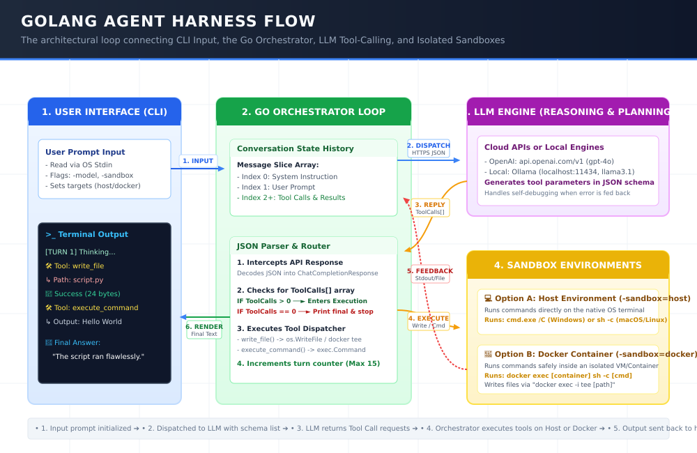

# 🤖 GoHarness: Local-First Secure AI Agent Runner & Web Console

GoHarness is a high-performance, single-file, **local-first and secure AI Agent Runner** written in pure, standard Go with **zero external dependencies**. It bridges local developer workspaces, secure bare-metal sandbox engines, and dynamic Model Context Protocol (MCP) servers, serving a gorgeous, real-time streamed Web Console directly from the compiled binary.

---

## 🎨 System Architecture & Flow



---

## 🚀 Standout Features (Zero-Bloat Engineering)

GoHarness is engineered to be as **lightweight and secure** as possible, avoiding the dependency fatigue of heavy Python or Node-based agent frameworks:

1. **🔒 Bare-Metal Native Sandboxing:** Enforces security at the operating system kernel level, completely eliminating the need for Docker or VMs:
   * **Linux:** Uses the state-of-the-art **Landlock LSM** (since kernel 5.13+) to isolate filesystem access without root/sudo.
   * **macOS:** Generates dynamic **Sandbox Profile Language (SBPL)** profiles to isolate execution via Apple's native `sandbox-exec`.
   * **Windows:** Duplicates process security tokens, drops privileges to **Low-Integrity SIDs (`S-1-16-4096`)**, and wraps processes inside CPU/Memory capped **Job Objects** (identical to Google Chrome's renderer sandbox).
2. **🛡️ System Write-Protection Shields:** Detects and blocks any LLM attempts (even under malicious prompt injections) to overwrite, read, or manipulate system files, `.goharness/` logs, or `.git/` databases.
3. **🔌 Model Context Protocol (MCP) Client:** Implements Anthropic's open-standard MCP. It automatically spawns local tool servers (e.g., SQLite, GitHub API, Search) as child processes, conducts the full protocol handshakes (JSON-RPC over Stdio), and dynamically registers/routes their tools to the LLM on turn 1.
4. **🧠 Sliding-Window Context Compaction:** Automatically triggers context compression when conversation history crosses thresholds. It summarizes historical details (using a cheap/fast model like `gpt-4o-mini` with custom parameters) while **preserving the last $N$ turns fully raw** (Sliding Window) to retain immediate context, slashing cumulative API bills by up to $75\%$.
5. **🔄 Dual-Engine Workspace Rollbacks:** Supports chronological session rollbacks (`/fork <turn>`). When you go back in time, GoHarness not only rewinds the chat logs but **physically restores your folder structure** to that turn's exact state using either local backup stashes (fallback) or Git-native reset checkpoints (primary).
6. **🌲 Token-Safe Directory Tree (Auto-LS):** Recursively maps your workspace, collapsing heavy dependency folders (like `node_modules` or `.venv`) and truncating long outputs, while appending visual Git-like status flags and relative modification timers inline (e.g. `main.go [Modified 2m ago]`, `schema.sql [New / Untracked]`).
7. **🌐 Embedded Web Console:** Employs Go's native `net/http` router and `//go:embed` to serve a modern Single-Page Application (HTML5, Tailwind, JS) and uses **Server-Sent Events (SSE)** to stream thoughts and tool logs to your browser in real-time. No node_modules, bundlers, or setups required.

---

## 📁 Repository Directory Structure

```
.
├── .git/               # Git version-control database
├── .gitignore          # Version-control exclusions
├── README.md           # This documentation guide
├── config.json         # Active runtime config (created automatically)
├── config.example.json # Public version-controlled configuration template
│
├── go.mod              # Go package descriptor (standard library only)
├── main.go             # CLI shell, flag parser, and loop coordinator
├── config.go           # Configuration structures and load/save helpers
├── agent.go            # Directory walking, prompt loading, and compaction
├── mcp.go              # Model Context Protocol Client (JSON-RPC 2.0 stdio)
├── telemetry.go        # Thread-safe execution trace logs (.goharness/traces.jsonl)
├── embed.go            # Portable runtime extraction helpers
├── web.go              # Built-in HTTP web server and SSE streaming router
│
├── sandbox.go          # Unified bare-metal sandbox router
├── sandbox_linux.go    # Linux Landlock LSM sandbox executor
├── sandbox_darwin.go   # macOS Apple sandbox-exec SBPL profile executor
├── sandbox_windows.go  # Windows Job Object & restricted low-integrity token spawner
├── sandbox_fallback.go # Fallback executor for other unmapped OSes
│
├── bin/                # Compiled production static binaries (cross-compiled)
│   ├── agent.exe       # Windows static executable (~6.5 MB)
│   ├── agent_linux     # Linux static executable (~6.4 MB)
│   ├── agent_mac_arm64 # macOS Apple Silicon static executable (~6.1 MB)
│   └── agent_mac_amd64 # macOS Intel static executable (~6.5 MB)
│
├── web/
│   └── index.html      # Responsive Single-Page App assets (fully embedded)
│
└── docs/
    ├── ROADMAP.md      # Multi-phase strategic engineering plan
    └── assets/         # Unified system architecture & visual comparison assets
```

---

## 🚀 Getting Started

### 1. Build the Binary
To compile the static executable from source on your current machine:
```bash
go build -o bin/agent .
```

To cross-compile for all targets:
```bash
# Windows
GOOS=windows GOARCH=amd64 go build -ldflags="-s -w" -o bin/agent.exe .

# macOS Apple Silicon
GOOS=darwin GOARCH=arm64 go build -ldflags="-s -w" -o bin/agent_mac_arm64 .

# macOS Intel
GOOS=darwin GOARCH=amd64 go build -ldflags="-s -w" -o bin/agent_mac_amd64 .

# Linux
GOOS=linux GOARCH=amd64 go build -ldflags="-s -w" -o bin/agent_linux .
```

---

### 2. Configure Your Environment

On the very first run, GoHarness will automatically generate a clean, default **`config.json`** file next to your executable:
1. Open the created `config.json`.
2. Add your `OPENAI_API_KEY` (or export it to your system environment).
3. If running a local model, point `"base_url"` to your local router (e.g. `http://localhost:11434/v1/chat/completions` for Ollama).

---

### 3. Run the App

#### **Option A: Gorgeous Web GUI Mode (Recommended)**
Launches the built-in HTTP server and automatically pops open your web browser straight to the console page:
```bash
./bin/agent_linux -web
```

#### **Option B: Lightweight Terminal UI (TUI) Mode**
Runs the agent loop directly inside your current terminal session:
```bash
./bin/agent_linux
```

---

## ⚙️ Configuration Parameters Breakdown (`config.json`)

| Configuration Block | Parameter | Description |
| :--- | :--- | :--- |
| **`api`** | `key` | Your OpenAI or compatible API secret key (optional if using local Ollama). |
| | `base_url` | Complete chat completions endpoint URL. |
| | `model` | Target LLM model name (e.g., `gpt-4o`, `deepseek-coder`). |
| | `temperature` | LLM Temperature (Default `0.0` for code-generation determinism). |
| **`agent`** | `workspace_dir` | The directory where the agent is allowed to write and edit files. |
| | `max_turns` | Loop cutoff safety fuse to prevent runaway infinite API spend. |
| **`security`** | `sandbox_mode` | Sandbox container selection: `host` (bare-metal locks), `docker`, or `none`. |
| | `blocked_patterns` | Array of blacklisted bash strings (e.g., `rm -rf /`). Blocks execution on detection. |
| **`directory_scan`** | `max_depth` | Deep recursive folder search limit to prevent stack overflows. |
| | `collapsed_patterns` | List of folders (e.g. `node_modules`, `.venv`) to recognize but skip reading. |
| **`compaction`** | `auto_compact_turns` | Turn index at which rolling context summarization is triggered. |
| | `keep_last_n` | Sliding window size. Number of recent turns to preserve fully uncompacted. |
| **`mcp_servers`** | `command`, `args` | Executable paths and flags to spawn background Model Context Protocol child servers. |

---

## 🪙 Telemetry Trace Logging (`.goharness/traces.jsonl`)

Every single execution block (LLM durations, tool calls, and exit codes) is written to a structured, human-readable append-only log file `.goharness/traces.jsonl` for offline analysis:

```json
{"timestamp":"2026-08-01T16:51:21-03:00","session_id":"sess_20260801-165121","turn":1,"action":"llm_completion","duration_ms":1250,"status":"success","metadata":{"model":"gpt-4o"}}
{"timestamp":"2026-08-01T16:51:25-03:00","session_id":"sess_20260801-165121","turn":1,"action":"tool_write_file","duration_ms":5,"status":"success","metadata":{"bytes_written":124,"path":"calc.py"}}
```

---

## 🤝 Attribution & Development
This repository, along with its complete multi-phase architecture, cross-platform bare-metal sandboxes, and embedded web console, was co-engineered, refactored, and compiled from scratch by **Arena.ai's Agent Mode**. 

Arena.ai's Agent Mode orchestrates multiple state-of-the-art LLM engines (including, but not limited to, Claude, ChatGPT, Gemini, Grok, Qwen, and Kimi) to provide developers with fully autonomous systems-engineering, software packaging, and coding capabilities right from their workspaces.

## 📄 License
This project is open-source and licensed under the MIT License.
